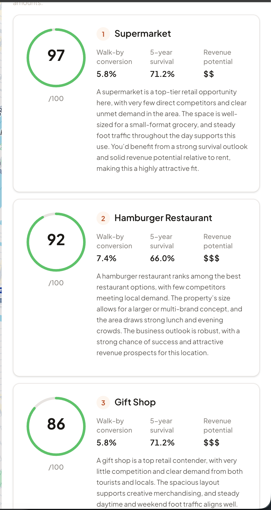
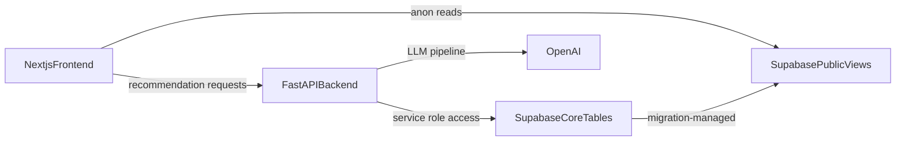

# BizzyCity

BizzyCity helps evaluate Manhattan commercial properties and suggests businesses to open using property signals, neighborhood analysis, and recommendation scoring.

Built for the [UB IEEE Innovation Hackathon](https://ub-ieee-hackathon.com/), where this project won in the Smart Infrastructure and Mobility class.

Challenge prompt:
> "Develop solutions for smart cities, transportation systems, and urban planning using IoT and AI technologies."

Live demo: [https://bizzycity.vercel.app/](https://bizzycity.vercel.app/)

## Screenshots

### Map Page


### Recommendations



## Repository Structure

- `frontend/`: Next.js 16 app (map, property detail panel, recommendations UI)
- `backend/`: FastAPI service for health checks and recommendation generation
- `supabase/`: Supabase config, schema, and SQL migrations
- `scripts/`: Operational scripts (backfill and recommendation-related utilities)
- `docs/`: Project documentation and screenshots

## Architecture



### Runtime Data Flow

1. Frontend fetches property and image data from `public.public_properties_demo` and `public.public_property_images_demo` with the anon key.
2. Frontend calls backend `GET /api/recommendations/{property_id}?generate={true|false}`.
3. Backend checks cached recommendations, validates required analyses, applies throttles, and generates with OpenAI when allowed.
4. Generated recommendations are saved in Supabase and returned to frontend.

## Quick Start (Local Development)

### Prerequisites

- Node.js 20+
- Python 3.11+
- npm
- Supabase CLI (for local database workflow)

### 1) Clone and Install Dependencies

```bash
# frontend
cd frontend
npm install
cd ..

# backend
python -m venv .venv
.venv/bin/python -m pip install --upgrade pip
.venv/bin/python -m pip install -r requirements.txt
```

### 2) Configure Environment Variables

- Frontend:
  ```bash
  cd frontend
  cp .env.local.example .env.local
  ```
- Backend:
  - create repo-root `.env` with:
    - `SUPABASE_URL`
    - `SUPABASE_SERVICE_KEY`
    - `OPENAI_API_KEY`
    - optional: `FRONTEND_URL`
    - optional throttling controls:
      - `DEMO_GENERATE_WINDOW_SECONDS`
      - `DEMO_GENERATE_MAX_ATTEMPTS`
      - `DEMO_DAILY_GENERATION_CAP`

### 3) Start Services

Use separate terminals:

```bash
# terminal 1: Supabase local stack (optional if using hosted Supabase)
supabase start
```

```bash
# terminal 2: backend API
.venv/bin/python -m uvicorn backend.api.main:app --host 0.0.0.0 --port 8000
```

```bash
# terminal 3: frontend
cd frontend
npm run dev
```

Open `http://localhost:3000`.

## Service Documentation

- Frontend: `docs/frontend.md`
- Backend: `docs/backend.md`
- Supabase: `docs/supabase.md`

## Security and Public Data Contract

- Frontend anonymous access is intentionally restricted to public-safe views:
  - `public.public_properties_demo`
  - `public.public_property_images_demo`
- Base tables contain internal model/debug fields and are not intended for direct anon reads.

